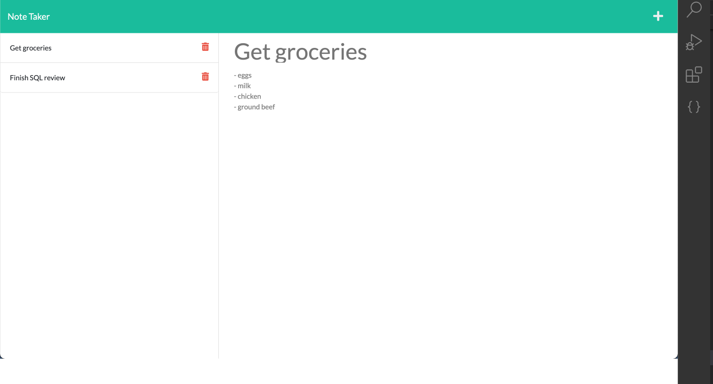

### Deployed Live Version
* https://bd-dynamic-notes.herokuapp.com/

# Dynamic FullStack Note-Taker 

  ## Table of Contents:

  * [Description](#description)</a>

  * [Installation Instructions](#installation-instructions)

  * [Usage Info](#usage-info)

  * [Contribution Guidelines](#contribution-guidelines)

  * [Test Instructions](#test-instructions)

  * [Questions](#questions)

  ## Description

  A note has a title and text about it that will be persisted to a local json file as a database.Currently the application has CRUD functionality, except the ability to update past notes. 
    ## Live Demo Screenshot

  ## Installation Instructions

    
<pre>Install Node.js</pre>

<pre>npm i</pre>

<pre>node server.js</pre>

  ## Usage Info
Offer users ability to create notes that can be persisted and revisted at a later date.

  ## Licenses: 
 MIT
 
      
  
    

  ## Contribution Guidelines
Independent project. DM for fork/pull request.

  ## Test Instructions

  
<pre></pre>

  ## Questions

  * Github: bdejene19

  * Email: bdejene19@gmail.com

  * [Portfolio](https://bdejene19.github.io/updatedPortfolio/)
 
  

  

